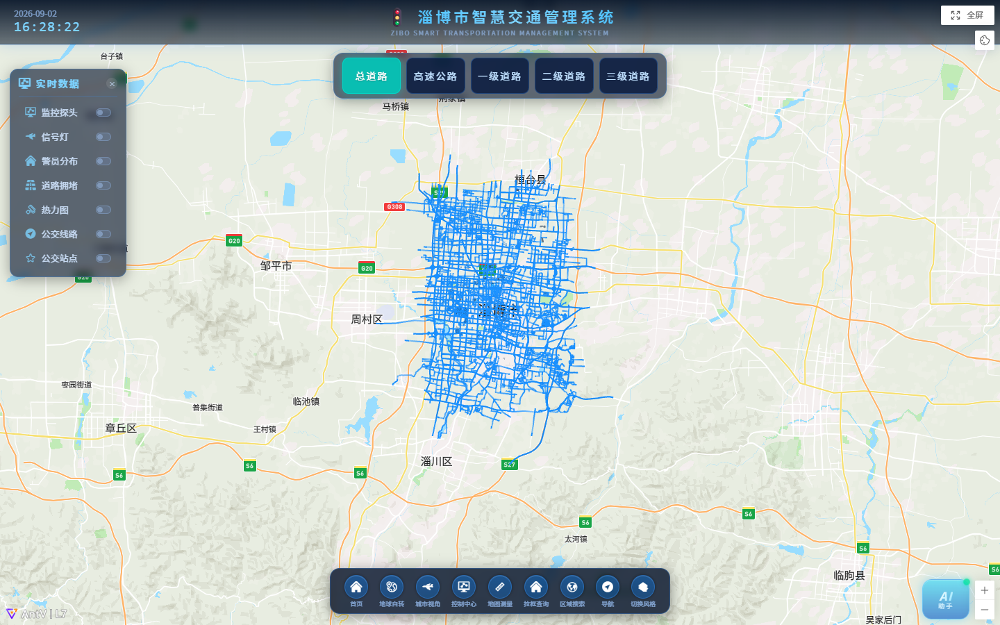
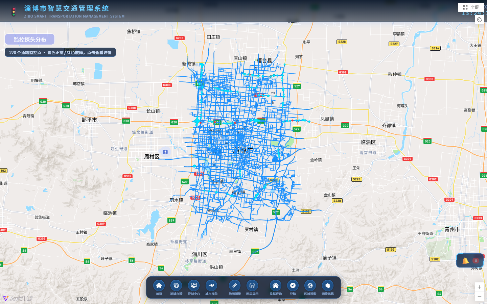
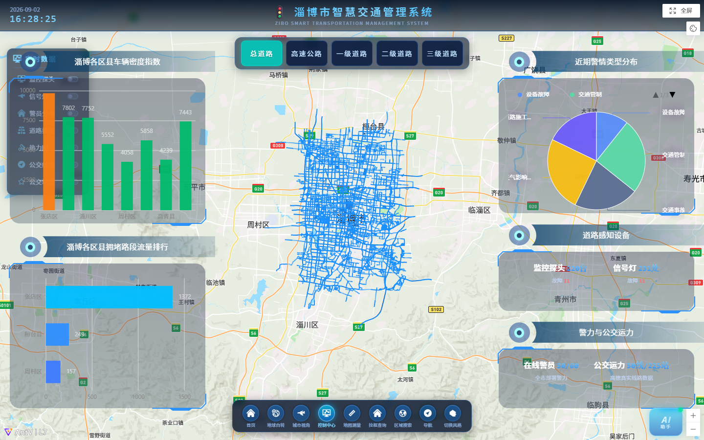
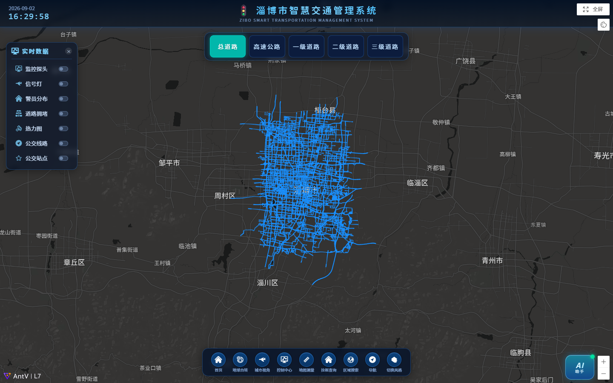
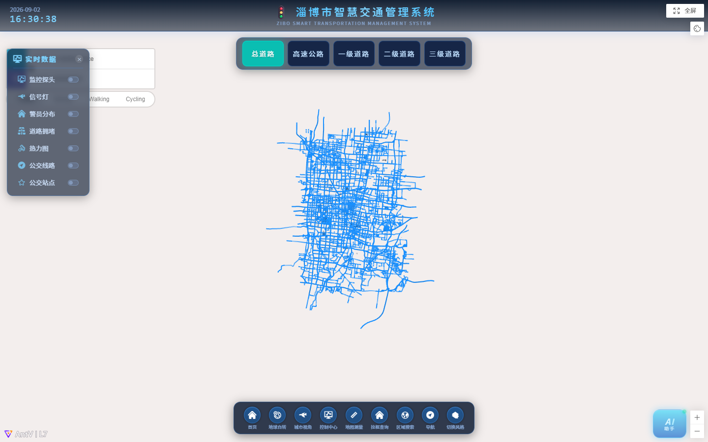
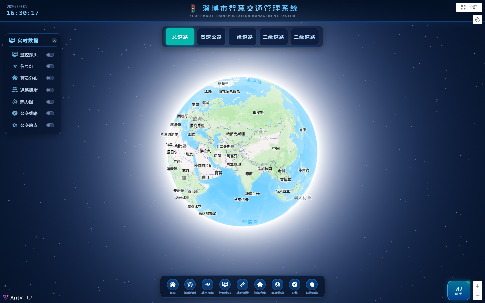
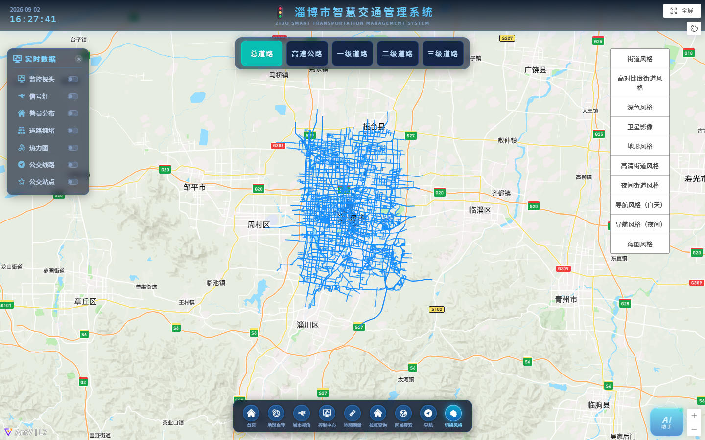
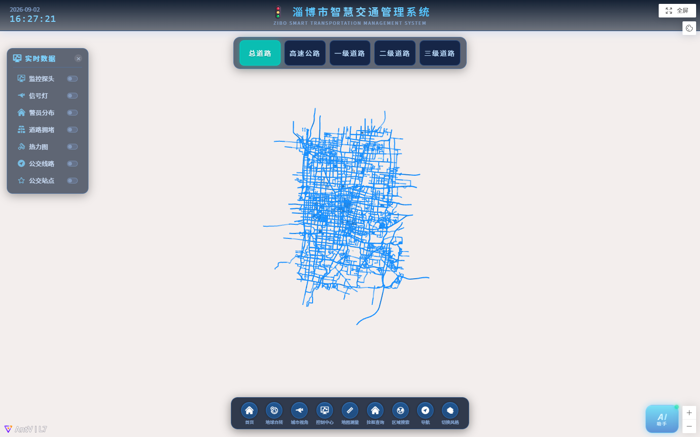
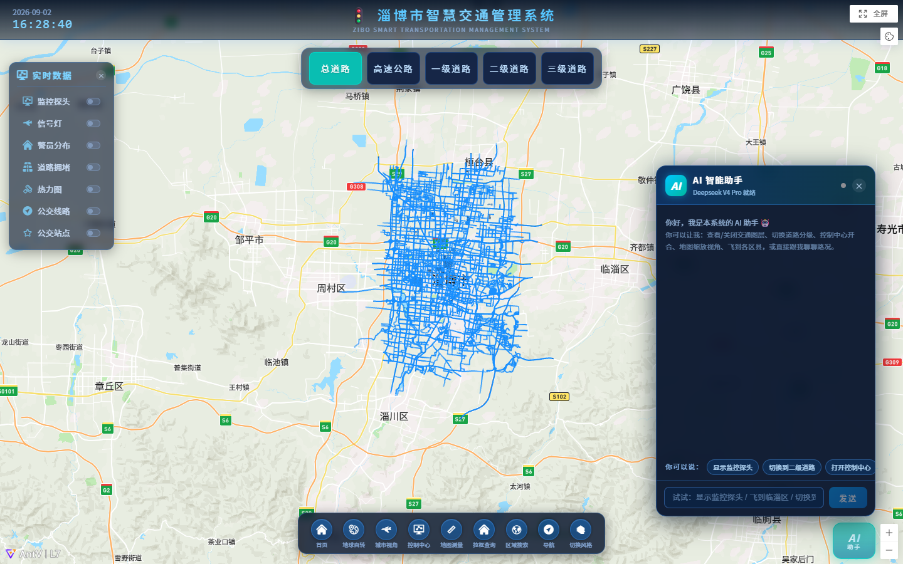

# 🚦 淄博市智慧交通管理系统 WebGIS 综合可视化平台


## 📝 项目简介

一个综合性的 **WebGIS 结课开发实践项目**，以「淄博市智慧交通」为核心研究区域，采用**纯前端 + 开放地图服务 API** 架构，基于 Vue3 + AntV L7 + Mapbox GL 构建实时交通监控与可视化大屏。系统沿真实 OSM 路网与区县中心布设监控探头、信号灯、警员等要素，融合高德公交、天气、行政区划等真实服务数据，实现了从宏观地球视角到微观道路监控、从静态图层叠加到 **AI 语音指令驱动**的全方位交互体验。

- **研究区域**：淄博市（中心 `118.05°E, 36.81°N` · 张店区）
- **特色亮点**：内置 AI 助手（DeepSeek 大模型 + 函数调用），文字/语音指令即可驱动导航、飞行、图层、风格等全部页面功能；无网络或 Key 失效时自动降级为离线规则引擎，常用指令依旧可用
- **界面布局**：纯净地图 + 顶部玻璃渐变标题栏 + 底部悬浮胶囊工具条（视图 → 控制 → 查询 → 风格平铺）

## ✨ 核心功能模块 (Features)

功能模块与 `src/views/` 下的组件高度解耦，主要包含以下亮点：

* 🌍 **宏观与微观视角切换**
    * **地球自转展示 (`Rotation.vue`)**：3D 地球视角自动旋转，支持无缝缩放至城市级别。
    * **城市飞行视角 (`CityView.vue`)**：多级平滑飞行，从淄博全景逐级落到街道尺度，俯瞰城市路网。
* 🚦 **智慧交通专题可视化**
    * **实时监控总览 (`Home.vue` + 底部工具条)**：监控探头 / 信号灯 / 警员 / 公交线路 / 道路拥堵 / 交通热力 / 公交站点 7 类要素开关式叠加，点击要素弹出详情气泡。
    * **控制中心 (`G2Charts.vue`)**：结合 G2Plot 三图（各区县车辆密度 / 拥堵路段流量排行 / 警情类型分布）+ 设施统计卡（探头 / 信号灯 / 警员 / 公交）。
    * **实时数据栏与道路分级栏 (`RealtimeBar.vue` / `RoadClassBar.vue`)**：左上角实时交通指数栏，顶部道路等级分层配色条。
* 🛠️ **专业地图分析工具**
    * **空间测量 (`MapDraw.vue`)**：多边形 / 矩形 / 圆形 / 线绘制，面积与距离实时测量。
    * **事件信息 (`EventInfo.vue`)**：交通警情事件分页列表，点击自动定位到事发位置。
* 📍 **便民 GIS 服务**
    * **路径导航 (`Navigation.vue`)**：基于 Mapbox 的驾车导航；起终点中文地名经高德精确坐标前置解析，杜绝错位路线。
    * **区域搜索 (`AreaSearch.vue`)**：高德行政区边界叠绘 + 实时天气面板（温度 / 湿度 / 风向 / 风力 / 报道时间）。
    * **底图风格切换 (`ChangeStyle.vue`)**：亮色 / 暗色 / 标准等底图风格一键切换。
* 🤖 **AI 助手 (`AIAssistant.vue`)**
    * 右下角悬浮，接入 DeepSeek 大模型（工具调用多轮对话），支持**文字与语音**输入：「导航到博山区」「显示监控探头」「去世纪路」「区域搜索淄博市」「切换到暗色风格」……
    * 指令通过反问确认后驱动真实页面跳转与地图操作，全程中文化反馈。

## 🏗️ 系统架构与技术栈

### 前端应用 (Frontend)
* **核心框架**：Vue 3（Composition API + `<script setup>`）
* **构建工具**：Vite 4
* **地图渲染底座**：AntV L7 2.15 / Mapbox GL 2.14（streets-v12 底图 + 中文汉化）
* **路径规划**：mapbox-gl-directions（高德地名坐标前置解析，绕开 Mapbox 对中文地名的错误解析）
* **图表与 UI**：G2Plot 2.4 + 纯 CSS 玻璃拟态大屏 UI（Element Plus 辅助）
* **状态与逻辑复用**：`store.js` 全局 reactive + provide/inject 响应式容器

### 数据与 AI 服务
* **高德开放平台**：地理编码 / 公交线路站点 / 实时天气 / 行政区边界
* **OSM**：真实路网、建筑几何与信号灯点位（Overpass 抓取）
* **DeepSeek**：AI 助手对话（Anthropic 协议端点，多轮工具调用 + thinking 过滤）

## 📁 核心目录结构

```text
Zibo-SmartTransportation-WebGIS/
├── public/                     # 静态资源与调试页
├── scripts/                    # 数据抓取与 CDP 端到端验证脚本
├── screenshots/                # README 系统截图（真实运行捕获）
├── src/                        # 前端源码
│   ├── assets/
│   │   ├── GIS_Data/           # 淄博路网 / 建筑 GeoJSON（OSM 真实几何）
│   │   └── images/             # 界面素材
│   ├── components/             # 页面级组件（Header / BottomTools / AIAssistant 等）
│   ├── views/                  # 九大功能视图（Rotation / CityView / G2Charts 等）
│   ├── tools/                  # GIS 工具类（initLayer / initTrafficLayers / weather 等）
│   ├── Hooks/                  # 控制中心图表数据逻辑
│   ├── router/                 # 路由配置
│   ├── store.js                # 全局 reactive 状态
│   ├── App.vue                 # 地图初始化（style 加载完成后再挂 L7 图层与 UI）
│   └── main.js
├── .gitignore
├── index.html                  # 入口（iconfont / 数字字体）
├── package.json                # 依赖管理
└── vite.config.js              # 构建配置
```

## 🗄️ 数据来源说明

数据均来自可公开获取的开源 / 开放接口，公安敏感数据不涉及：

1. **路网与建筑几何**：OSM 真实路网（`src/assets/GIS_Data/Zibo_roads.json`、`Zibo_Buildings.json`）。
2. **信号灯点位**：OSM Overpass API 抓取（高德无信号灯开放数据）。
3. **监控摄像头点位**：道路监控不公开，沿真实 OSM 路网约 1km 间隔布设（几何真实）。
4. **公交线路 / 站点**：高德开放平台 Web 服务 API。
5. **行政区边界 / 实时天气 / 地名坐标**：高德开放平台（geocode / weather / geo.datav 边界）。
6. **警员 / 警情 / 拥堵指数**：公安与交通态势数据不公开，基于真实区县中心与真实路名模拟生成；统一固定随机种子保证可复现，实时字段由 ticker 驱动波动。

## 🚀 部署与运行指南

### 1. 前置环境要求
* Node.js（建议 v16+）
* pnpm（推荐，`npm install -g pnpm` 安装）

### 2. 克隆项目并配置 API Key

密钥**不入版本库**（`.env` 已被 .gitignore 排除，GitHub 推送保护也会自动拦截含密钥的提交），请自行申请后在本机配置：

```bash
git clone https://github.com/jiao9328/WebGIS-demo.git
cd WebGIS-demo
```

在项目根目录创建 `.env` 文件，填入自己的密钥：

```dotenv
# Mapbox（地图底图，必填）→ https://account.mapbox.com/ 新建默认 token（pk. 开头）
VITE_MAPBOX_TOKEN=pk.your_mapbox_access_token

# 高德（区域搜索/天气/地名解析，必填）→ https://console.amap.com/ 新建「Web 服务」类型 Key
VITE_AMAP_KEY=your_amap_web_service_key

# DeepSeek（AI 助手，选填）→ https://platform.deepseek.com/ ；缺省时 AI 助手自动降级为离线规则引擎
VITE_DEEPSEEK_KEY=sk-your_deepseek_api_key

# DeepSeek 模型名（选填，默认 deepseek-v4-pro）
VITE_DEEPSEEK_MODEL=deepseek-v4-pro
```

### 3. 运行项目

```bash
pnpm install      # 安装依赖
pnpm dev          # 启动开发服务器 → http://localhost:5173
pnpm build        # 生产构建 → dist/
```

浏览器打开 http://localhost:5173 ，听到「淄博智慧交通管理系统已就绪」语音播报即启动成功。

## 📷 系统截图

**🗺️ 主界面总览** > 顶部玻璃渐变标题栏、底部悬浮工具条与左上角实时交通数据栏。


**🚔 监控探头图层** > 道路监控点位叠加展示，点击要素弹出详情。


**📊 控制中心图表** > G2Plot 多图 + 设施统计卡片，直观展示城市交通运行指标。


**📏 空间绘制测量** > 提供多边形 / 矩形 / 圆形 / 线的绘制与测量功能。


**🧭 驾车路径导航** > 中文起终点精确解析，自动绘制路线并缩放至全程视野。


**🌍 地球旋转视角** > 3D 地球开场动画，支持无缝缩放至城市级别。


**🎨 底图风格切换** > 亮色 / 暗色 / 标准底图风格自由切换。


**⛅ 区域搜索与实时天气** > 按行政区划检索并展示实时气象信息。


**🤖 AI 语音助手** > 自然语言指令驱动全站功能，支持多轮对话。


## 🤝 贡献与许可

本项目为 WebGIS 课程结课实践项目，公开分享供学习与交流。欢迎在 [Issues](https://github.com/jiao9328/WebGIS-demo/issues) 中提问、反馈或交流想法。
